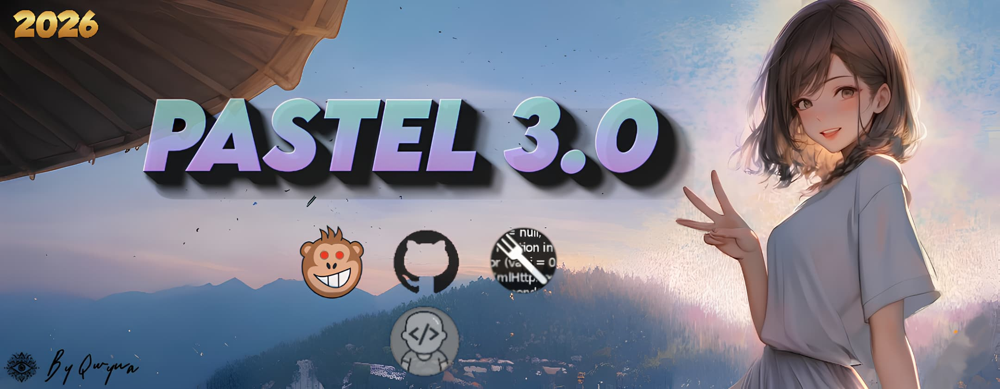
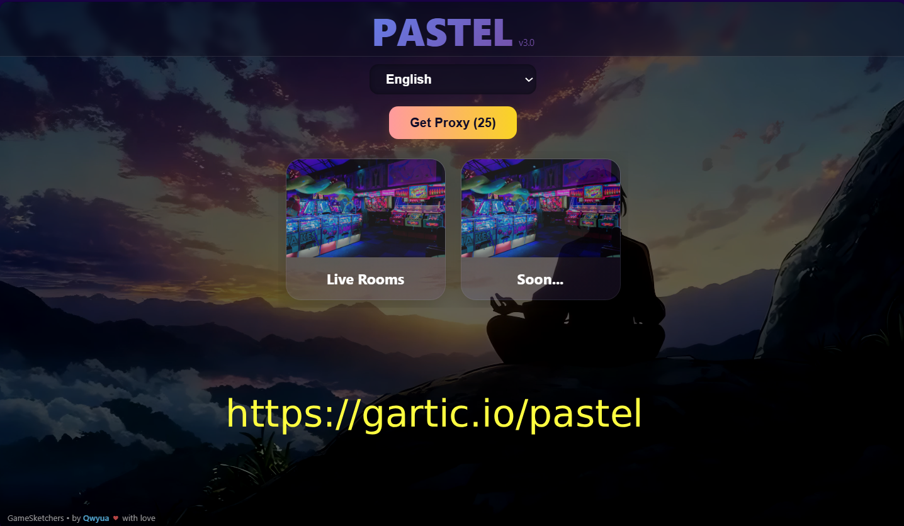
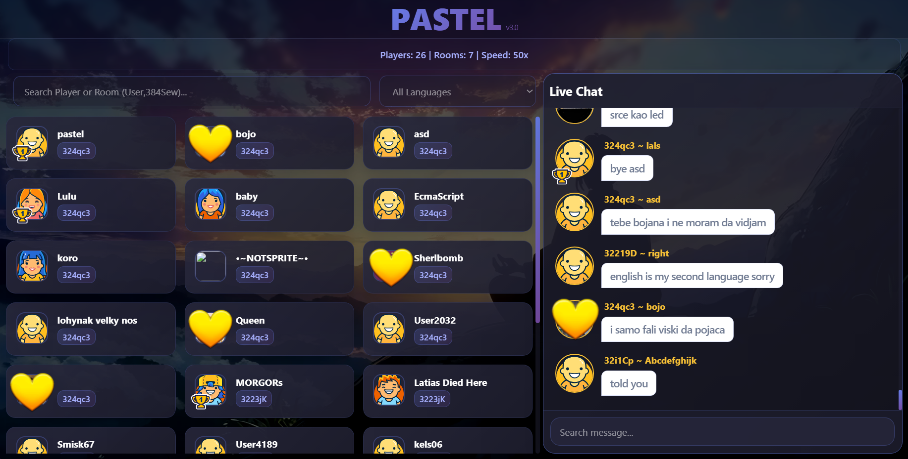

<h1 id="pastel" align="center"> 🌷 PASTEL LIVE ✨</h1>

  

**Pastel Live** is a browser script designed for **Violentmonkey** only — it does **NOT** work on Tampermonkey. Inspired by previous player-tracking scenarios, it gives you live insights into ongoing games.  

---

## 🚀 Features

- 🎮 **Live Game Chat** – See ongoing conversations in real-time  
- 👥 **Live Players** – Track who is online right now  
- 🕵️ **Player Room Info** – Know which player is in which room and who they’re talking to  
- ⚡ **Minimal UI & Visual Feedback** – Designed for clarity and speed  
- 🔗 **Cross-Browser Friendly** – Works in browsers supporting Violentmonkey  

> inspired by past player search scenarios.

---
## 🖼️ Screenshots & Demo

<table align="center">
  <tr>
    <td align="center">
       
      <em>Select Languages & Add Proxy</em>
    </td>
    <td align="center">
       
      <em>Live players & live chat view.</em>
    </td>
  </tr>
</table>

---

## 🛠️ Installation (Violentmonkey Only)

- 🖥️ Install <a href="https://chrome.google.com/webstore/detail/violentmonkey/jinjaccalgkegednnccohejagnlnfdag" target="_blank"><strong>Violentmonkey</strong></a> browser extension  
- 📥 Download the script: <a href="./Pastel%20Live.user.js" target="_blank">PastelLive.user.js</a>  
- 🔧 Open Violentmonkey → <a href="https://greasyfork.org/en/scripts/550324" target="_blank"><strong>Import Script</strong></a> → Select the downloaded file  
- 🚀 Script is automatically activated — enjoy <a href="https://gartic.io/live" target="_blank">live</a> tracking

> ⚠️ <strong>Important:</strong> This script <strong>will not work on Tampermonkey</strong> or other managers.

## 📜 License

MIT © 2025 [Qwyua](https://github.com/qwyua)

---

> **Pro Tip:** For the best experience, always keep Violentmonkey up to date and run Pastel Live on supported browsers.  

 Thanks 💖 Design inspiration Pastel Readme.md from <a href="https://github.com/GameSketchers/Kawaii-Helper">Kawaii-Helper</a>

